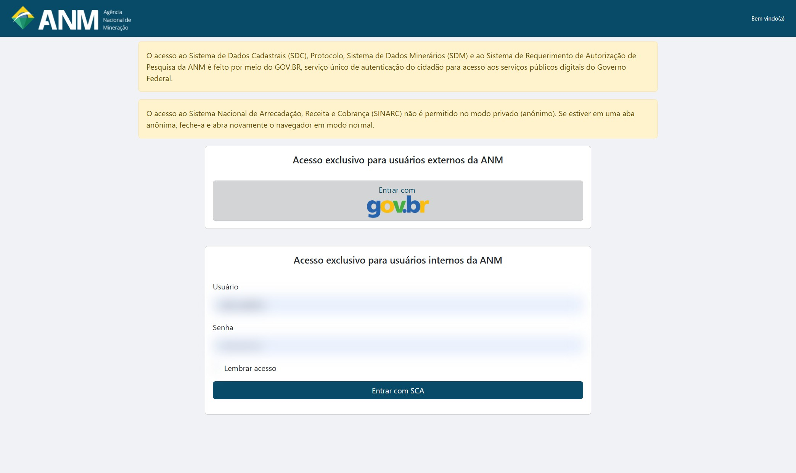
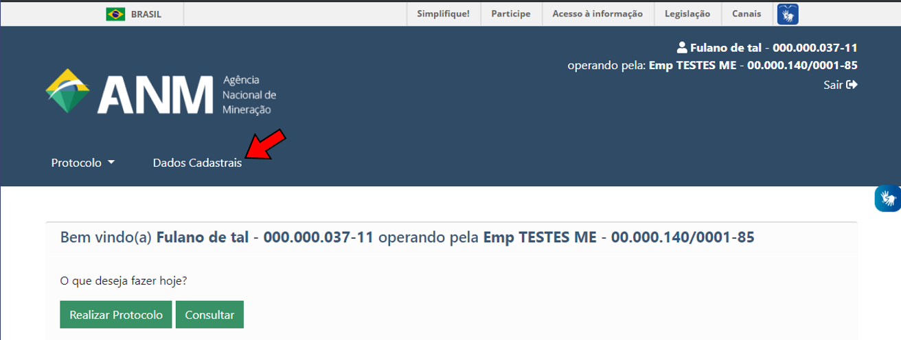
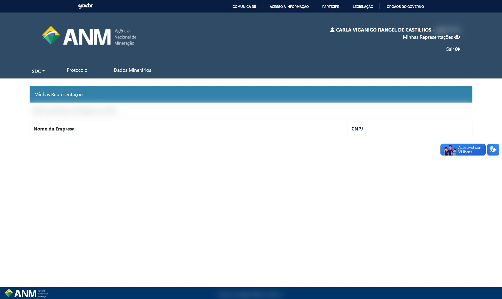
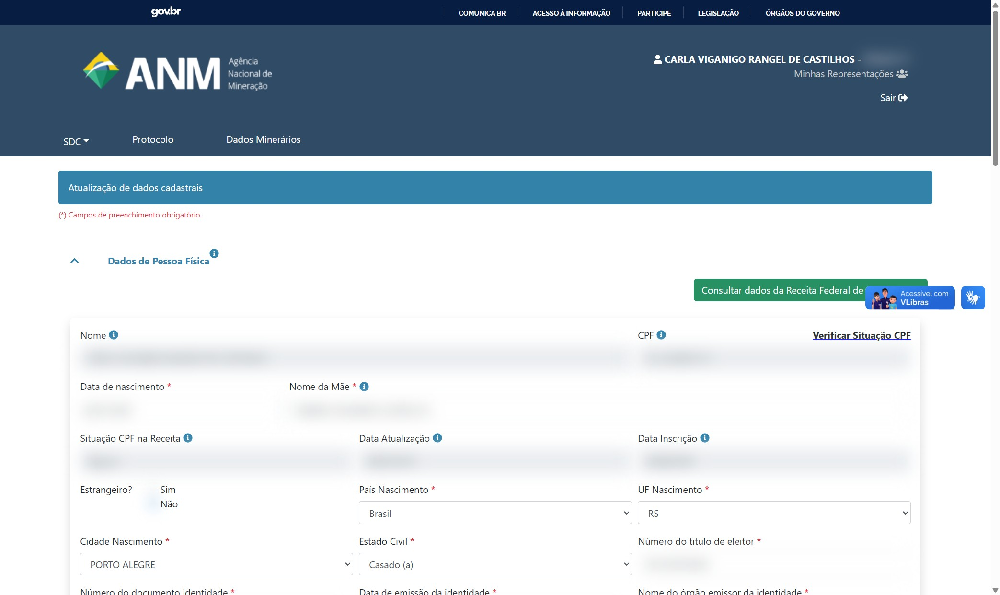
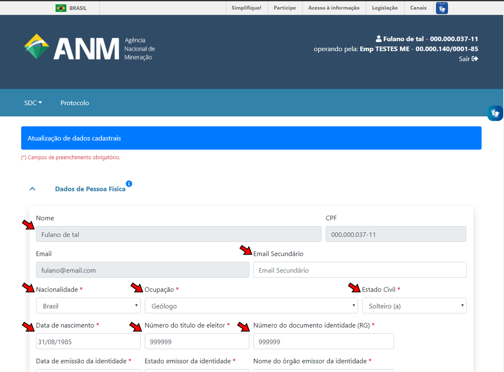
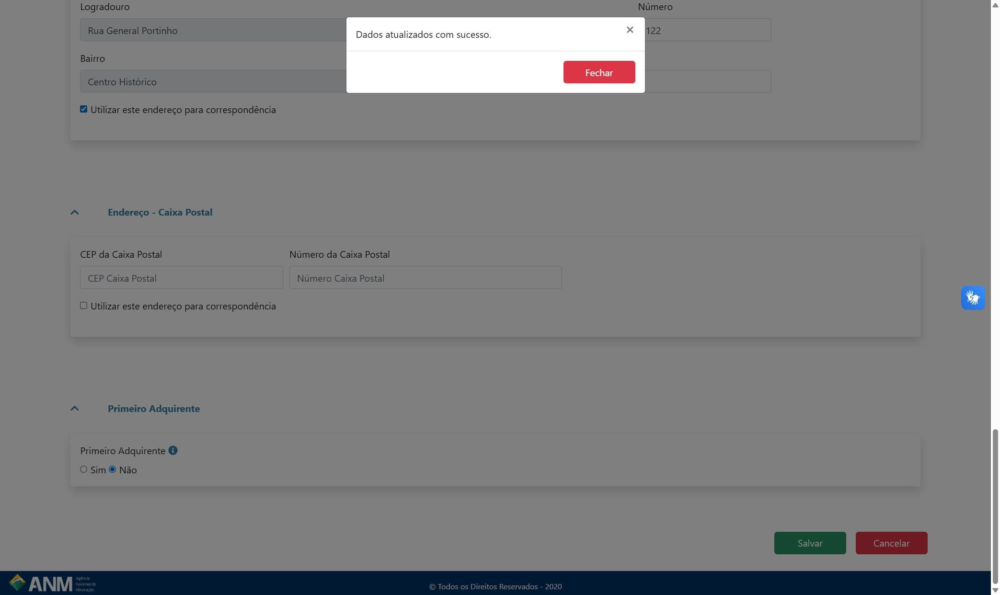

Como acessar o novo Sistema de Dados Cadastrais?
================================================

O acesso ao novo Sistema de Dados Cadastrais se dá pelo endereço:

https://sdc.anm.gov.br/

1) Será exibida a tela de login, clique em "Entrar com gov.br".:

2) Uma vez logado, acesse a aba **Dados Cadastrais** para ter acesso ao Sistema de Dados Cadastrais (SDC):

3) O Sistema de Dados Cadastrais possui suporte aos dados de pessoa física e jurídica. 

Os campos de pessoa jurídica se tornam visíveis quando o usuário estiver operando em nome de uma pessoa jurídica, acessível em "Minhas Representações":

Dica! Caso a empresa não esteja aparecendo na lista, confirme se o seu cpf está entre os relacionados ao CNPJ no Portal do Gov.br.

Saiba mais como vincular empresas e colaboradores no Gov.br em:

https://acesso.gov.br/faq/

https://www.gov.br/governodigital/pt-br/acessibilidade-e-usuario/atendimento-gov.br/duvidas-na-conta-gov.br

4) Na página do Sistema de Dados Cadastrais, atualize os dados cadastrais dos campos liberados para edição.

O SDC é composto pelas seções:

**Dados de Pessoa Física:**

* Dados de identificação da pessoa física
* Endereço - residencial
* Endereço - comercial
* Endereço - caixa postal

**Dados de Pessoa Jurídica:**

* Dados de identificação da pessoa jurídica
* Endereço - comercial
* Endereço - correspondência
* Endereço - caixa postal
* Quadro de Sócios Administradores

*Os campos fechados para edição (em cinza) são dados provenientes da sua conta no Gov.BR*

A mensagem de "Dados atualizados com sucesso" garante que a empresa foi cadastrada e/ou atualizada com sucesso.

