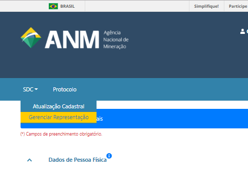
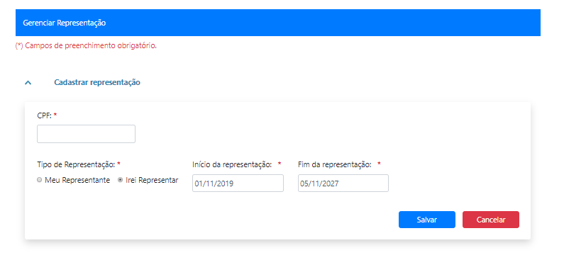
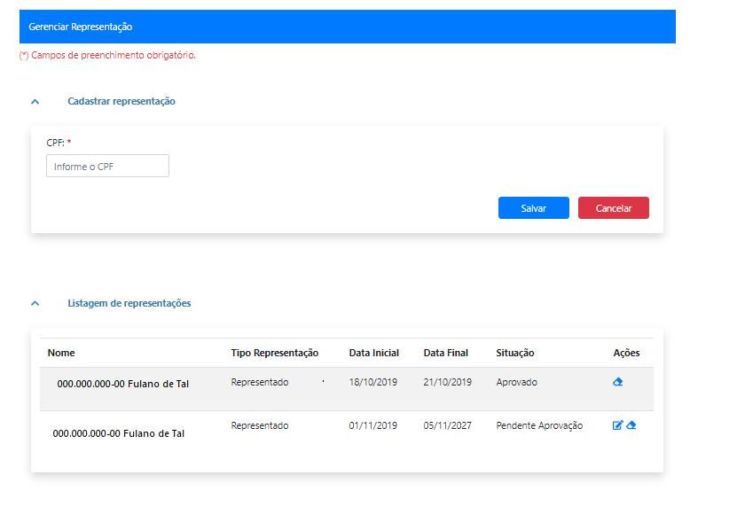

Posso acessar o Protocolo Digital em nome de outra pessoa física? Como?
======================================================================

Depende do tipo de protocolo.

Protocolos realizados por código de requerimento
************************************************

Para os pré-requerimentos do Cadastro Mineiro que geram código de
requerimento, é possível atuar em nome de outra pessoa física por meio da
funcionalidade **Gerenciar Representação**, disponível no Sistema de Dados
Cadastrais (SDC).

O representante e o representado podem autorizar outras pessoas físicas
(como responsáveis técnicos ou representantes legais) a realizar protocolos
em seu nome por um período determinado.

Para utilizar essa funcionalidade:

* o representante e o representado devem possuir conta Gov.br nível prata
  ou ouro;
* ambos devem estar cadastrados no Sistema de Dados Cadastrais (SDC) da ANM;
* a representação deve ser aprovada pelo representado.

Após a aprovação, o representante poderá utilizar a opção
**"Protocolar por código de requerimento por terceiro"**.

.. note::

   A responsabilidade pelo cadastro, manutenção e encerramento da
   representação, bem como pelos atos praticados durante sua vigência,
   é exclusiva das partes envolvidas.

Protocolos realizados por número de processo
********************************************

Nos protocolos vinculados diretamente a um processo minerário, não é
necessário utilizar a funcionalidade **Gerenciar Representação** do SDC.

Nesses casos, o usuário pode acessar o Protocolo Digital com sua própria
conta Gov.br e protocolar documentos referentes a processo de titularidade
de outra pessoa física, desde que apresente a documentação necessária para
comprovar a representação ou a manifestação de vontade do titular.

Exemplo:

Cumprimento de exigência em processo minerário de titularidade de pessoa
física.

Nesse caso, basta apresentar o requerimento assinado digitalmente pelo
titular ou, quando o documento for assinado por outra pessoa, a respectiva
procuração que comprove os poderes de representação.

.. warning::

   A responsabilidade pela autenticidade dos documentos apresentados e pela
   representação exercida é exclusiva das partes envolvidas.
